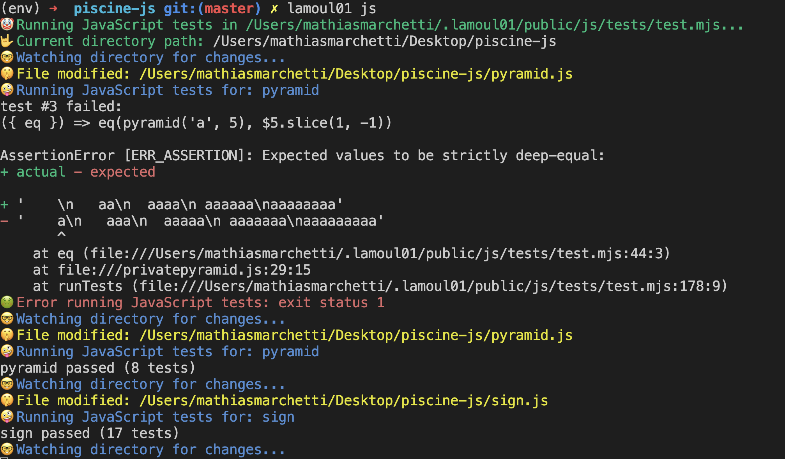

# lamoul01 (for go and javascript)
Ever get stuck in the dreaded 3-minute push cooldown at the 01 Edu piscine? Say goodbye to the wait! Our app lets you run moulinette tests right in your terminal, so you can catch errors on the fly and keep your momentum going. No more ‘coding timeouts’—just pure, uninterrupted productivity!


# How to install
No cheater, it’s not going to be easy for you to go over the cooldown. First, you need to pass a few steps to prove you deserve lamoul01 to flex at the piscine.

## Prerequisites
First of all, you need to install GoLand. If you are swimming in the JavaScript piscine, you also need [npm](https://www.npmjs.com/) and [Node.js](https://nodejs.org/).

## Step 1
You have to create a hidden directory named "lamoul01" in your Home directory. Be sure to check what a hidden directory is and what your Home directory is.

## Step 2
### For JavaScript
1. Inside your new hidden directory, use the git command to clone this repo: [https://github.com/01-edu/public.git](https://github.com/01-edu/public.git).
2. Now, find the directory `js/tests` and go inside.
3. Inside this directory, install [Puppeteer](https://pptr.dev/guides/installation)
4. Ok, it's almost done, cheater.
5. sometimes you will have a fetch error (depending on node or your os) so if you have this error while running lamoul, please do that in the same folder tests: install [node-fetch](https://www.npmjs.com/package/node-fetch).
6. Open the file `test.mjs` and at the top of the file put:
   ```javascript
   import fetch from 'node-fetch';
### For go
(have to be done)
## Final step
go to your piscine directory and run this command :
```sh
go install github.com/aquemaati/lamoul01/cmd/lamoul01  
```
# How to use
Launch these commands and let lamoul test for you:
```sh
lamoul01 js
lamoul01 go
```
### Issue
If command not found:<br>
``` sh
echo 'export GOPATH="$(go env GOPATH)"' >> ~/.zshrc
echo 'export PATH="${PATH}:${GOPATH}/bin"' >> ~/.zshrc
source ~/.zshrc
```
Or go to yourusername/go/bin:<br>
```sh
sudo cp lamoul01 /usr/local/bin/
```



